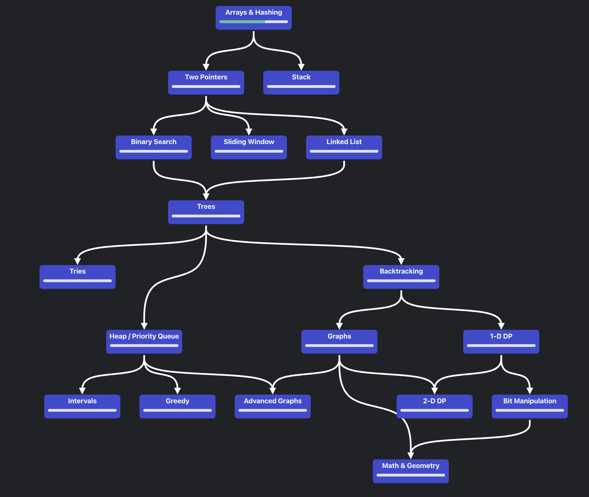
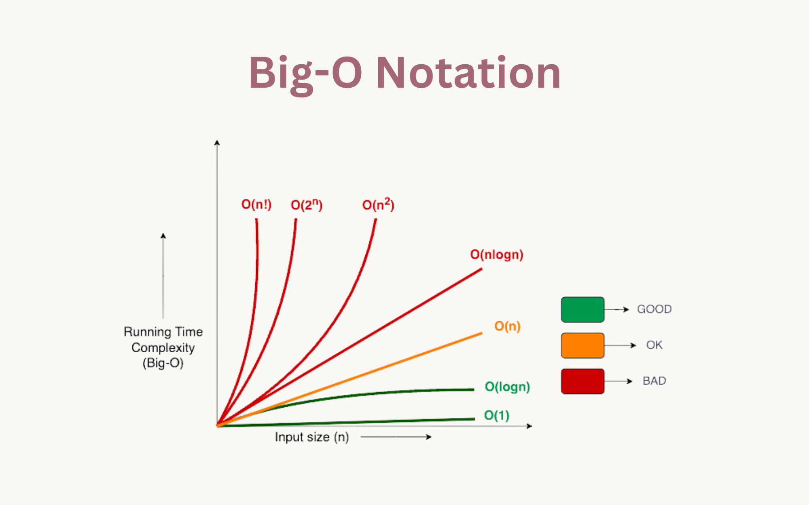

# 🚀 LeetCode Roadmap – Java Solutions

This repository contains my **LeetCode solutions in Java**, structured as a personal learning roadmap.  
For each problem, I explore **multiple solutions** (from brute force to optimal) until I achieve the most efficient approach.  

My goal is to demonstrate:
- Strong problem-solving skills.  
- Clear understanding of **time & space complexity**.  
- Ability to **optimize solutions** and explain trade-offs.  
- Clean, maintainable code that follows Java conventions.  

---

## 📌 Roadmap Overview

I follow a topic-based roadmap to systematically improve my Data Structures & Algorithms knowledge:  

---

## 📈 Big-O Complexity Guide

I carefully analyze each solution’s complexity to ensure optimization:  

- 🟢 **Good:** O(1), O(log n)  
- 🟠 **OK:** O(n), O(n log n)  
- 🔴 **Bad:** O(n²), O(2ⁿ), O(n!)  

---

## 📂 Repository Structure

